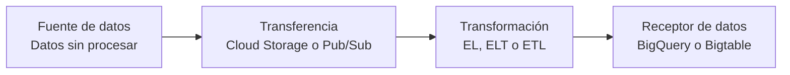

# Fundamentos de pipelines y tipos de datos

> [!summary] Idea clave
> Una canalización convierte **datos sin procesar** en información útil: parte de una **fuente**, mueve y transforma los datos, y termina en un **receptor** donde quedan disponibles para uso futuro, análisis y toma de decisiones.

[[00 - Índice|← Índice de la sección]] · [[02 - Elegir almacenamiento en Google Cloud|Siguiente: elegir almacenamiento →]]

## Recorrido de los datos

| Parte del recorrido | Función | Productos o patrones |
|---|---|---|
| **Fuente de datos** | Es el punto de partida. Puede ser cualquier sistema, aplicación o plataforma que cree, almacene o comparta datos. | Aplicaciones, sistemas y plataformas de origen. |
| **Transferencia y transformación** | Mueve los datos y los ajusta, modifica, une o personaliza para cumplir requisitos *downstream* o de informes. | **Cloud Storage**, **Pub/Sub** y los patrones **EL**, **ELT** y **ETL**. |
| **Receptor de datos** | Es la parada final, donde los datos procesados y transformados se almacenan para su uso posterior. | **BigQuery** y **Bigtable**. |

## Fuente y transferencia

Las fuentes contienen los datos sin procesar que esperan convertirse en información valiosa. En la fase de #Transferencia se pueden usar:

- **Cloud Storage:** un *data lake* capaz de almacenar varios tipos de datos procedentes de distintas fuentes.
- **Pub/Sub:** un sistema de mensajería asíncrona que entrega datos desde sistemas externos.

## Transformación

Transformar una fuente de datos significa **ajustar, modificar, unir o personalizar** sus datos para que respondan a requisitos específicos de sistemas *downstream* o de informes.

Los tres patrones principales son:

| Patrón | Orden |
|---|---|
| **EL** | Extracción → Carga |
| **ELT** | Extracción → Carga → Transformación |
| **ETL** | Extracción → Transformación → Carga |

## Receptor y almacenamiento

Un receptor de datos es la última parada del recorrido. En él, los datos procesados y transformados quedan almacenados para su uso futuro, análisis y toma de decisiones.

En la fase de #Almacenamiento se pueden usar:

- **BigQuery:** un almacén de datos sin servidores.
- **Bigtable:** una base de datos NoSQL altamente escalable.

## Tipos de datos

| Tipo | Características | Almacenamiento habitual |
|---|---|---|
| **Estructurados** | Se organizan en tablas, filas y columnas. | Soluciones orientadas a datos tabulares, como BigQuery. |
| **No estructurados** | Se almacenan de forma no tabular, como documentos, imágenes y archivos de audio. | Suelen ser más apropiados para Cloud Storage; BigQuery también puede almacenarlos mediante tablas de objetos. |

## Ejemplo concreto

Una aplicación de comercio electrónico genera eventos de compra. La aplicación es la **fuente**; **Pub/Sub** entrega los mensajes de forma asíncrona; los datos se cargan y transforman siguiendo un patrón **ELT**; finalmente, **BigQuery** actúa como **receptor** para conservarlos y analizarlos en informes de ventas.

`Aplicación → Pub/Sub → ELT → BigQuery`

## Puntos de examen

- **Fuente** y **receptor** no son lo mismo: la fuente origina o proporciona los datos; el receptor conserva el resultado del recorrido.
- Recuerda el orden exacto de **EL**, **ELT** y **ETL**.
- **Cloud Storage** es apropiado para datos no estructurados, aunque **BigQuery** también admite este tipo de datos mediante tablas de objetos.
- **Pub/Sub** entrega mensajes de manera asíncrona desde sistemas externos.
- **BigQuery** es un almacén de datos sin servidores; **Bigtable** es una base de datos NoSQL altamente escalable.

## Repaso activo

> [!question]- 1. ¿Qué puede considerarse una fuente de datos?
> Cualquier sistema, aplicación o plataforma que cree, almacene o comparta datos.

> [!question]- 2. ¿Cuál es la diferencia entre ELT y ETL?
> En **ELT**, los datos se cargan antes de transformarse; en **ETL**, se transforman antes de cargarse.

> [!question]- 3. ¿Dónde conviene almacenar datos no estructurados?
> Normalmente en **Cloud Storage**. **BigQuery** también puede almacenarlos mediante tablas de objetos.

> [!question]- 4. ¿Qué función cumple un receptor de datos?
> Es la parada final donde los datos procesados y transformados se guardan para su uso futuro, análisis y toma de decisiones.
