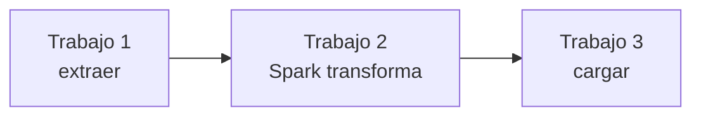

# ETL con Data Fusion y Dataproc

> [!abstract] Idea central
> En **ETL**, los datos se extraen, se transforman y luego se cargan en el destino analítico final. En Google Cloud puedes diseñar esa transformación visualmente con **Cloud Data Fusion** o ejecutar código de Hadoop y Spark con **Managed Service for Apache Spark**, llamado **Dataproc** en el curso.

[[Professional Data Engineer/2- Introducción a la ingeniería de datos en Google Cloud/05 - Patrón de extracción, transformación y carga (ETL)/00 - Índice|← Índice de la sección]] · [[Professional Data Engineer/2- Introducción a la ingeniería de datos en Google Cloud/04 - Patrón de extracción, carga y transformación (ELT)/01 - ELT y Dataform|← Sección anterior: ELT]] · [[02 - Streaming con Pub Sub y Dataflow|Streaming y Dataflow →]]

> [!info] Cambio de nombre
> Google unificó **Dataproc** y **Serverless for Apache Spark** bajo **Managed Service for Apache Spark**. El curso, la API, la CLI y varios recursos todavía usan el nombre Dataproc; para estudiar conviene reconocer ambos.

## ETL frente a ELT

| Patrón | Orden | Motor principal | Conviene cuando… |
|---|---|---|---|
| **ETL** | extraer → transformar → cargar | Data Fusion, Spark o Dataflow | hay que limpiar, adaptar o proteger los datos antes del destino final |
| **ELT** | extraer → cargar → transformar | BigQuery y Dataform | el warehouse puede transformar a escala y quieres conservar datos crudos para reprocesar |

> [!warning] Son ejes distintos
> **ETL/ELT** describe cuándo se transforma; **batch/streaming**, si los datos son acotados o continuos; **programado/por eventos**, qué inicia el flujo. Un pipeline ETL puede ser batch o streaming y ejecutarse por horario o por evento.

## Selector rápido

| Necesidad principal | Opción |
|---|---|
| Preparación visual sin código según el material del examen | **Dataprep by Trifacta** |
| Preparación asistida nativa de tablas de BigQuery | **BigQuery data preparation** |
| Integración empresarial visual, conectores y poco código | **Cloud Data Fusion** |
| Código existente de Spark/Hadoop o control del clúster | **Managed Service for Apache Spark — clústeres** |
| Ejecutar Spark sin administrar clústeres | **Managed Service for Apache Spark — serverless** |
| Una misma canalización programable para batch y streaming | **[[02 - Streaming con Pub Sub y Dataflow|Dataflow con Apache Beam]]** |

## Cloud Data Fusion

Cloud Data Fusion es un servicio administrado de integración de datos. En **Pipeline Studio** se construye un grafo arrastrando componentes:

1. **sources** leen desde sistemas locales o en la nube;
2. **transformations** limpian, unen o enriquecen;
3. **sinks** escriben en BigQuery, Cloud Storage u otros destinos.

Incluye conectores y transformaciones prediseñados, vista previa por etapa, programación, monitoreo y plugins personalizados. Al ejecutar una canalización batch, normalmente aprovisiona un clúster efímero de Managed Service for Apache Spark, ejecuta los trabajos y lo elimina.

Cuando una transformación es compatible, **Transformation Pushdown** puede ejecutarla en BigQuery; las operaciones no compatibles y la vista previa permanecen en Spark.

![[Pasted image 20260903105736.png|900]]

*Las dos tablas SAP convergen en `Joiner`. Desde ahí, un ramal escribe en Cloud Storage y el otro añade la fecha y hora antes de cargar en BigQuery. `Preview data` permite inspeccionar cada etapa antes de ejecutar todo el flujo.*

> [!note] Dataprep en el material del curso
> **Dataprep by Trifacta** es una oferta de socio y representa preparación visual sin código: conecta fuentes, combina transformaciones en *recipes*, muestra una vista previa y sugiere operaciones de limpieza. La guía vigente del examen todavía lo menciona. En la oferta nativa actual, **BigQuery data preparation** cubre preparación asistida dentro de BigQuery; conviene reconocer ambos contextos.

## Managed Service for Apache Spark — antes Dataproc

Es el servicio administrado para ejecutar cargas de trabajo de **Apache Spark** y, en clústeres, herramientas abiertas como Hadoop. Los resultados pueden escribirse en Cloud Storage, BigQuery o Bigtable.

![[Pasted image 20260903110437.png|900]]

> [!warning] Cloud Storage no es HDFS
> La imagen simplifica el origen como “HDFS data” en Cloud Storage. En realidad, **HDFS** usa discos del clúster; los trabajos acceden a objetos persistentes de Cloud Storage mediante el **Cloud Storage connector**. Separar cómputo y almacenamiento permite eliminar un clúster sin perder esos datos.

### Clústeres o serverless

| Modalidad | Qué administras | Úsala cuando… | Coste asociado |
|---|---|---|---|
| **Clúster administrado** | configuración, tamaño y ciclo de vida del clúster | migras cargas heredadas, necesitas herramientas OSS o control detallado | tiempo activo del clúster |
| **Serverless para Spark** | código y parámetros del trabajo | son trabajos nuevos, intermitentes o sesiones interactivas y no quieres operar infraestructura | recursos durante la ejecución |

Serverless admite lotes enviados desde consola, `gcloud` o API, y sesiones interactivas de notebooks. Ajusta los recursos automáticamente sobre infraestructura administrada; no crea un clúster que debas gestionar.

Los clústeres pueden ejecutarse en Compute Engine o como clústeres virtuales sobre GKE. Serverless admite únicamente Spark, además de opciones como contenedores personalizados. BigQuery también puede invocar código Python, Java o Scala mediante **procedimientos almacenados de Apache Spark**.

### Almacenamiento e integraciones

- **Cloud Storage**: entrada, salida y persistencia independiente del ciclo de vida del clúster.
- **HDFS local**: datos temporales ligados al clúster.
- **BigQuery y Bigtable**: acceso mediante conectores.
- **Persistent History Server**: consulta el historial de Spark a partir de *event logs*, normalmente guardados en Cloud Storage.
- **Dataproc Metastore**: administra metadatos compatibles con Hive; no almacena los datos del pipeline.

### Workflow Templates

Una plantilla define un grafo de trabajos —Spark, PySpark, Hadoop u otros—, sus dependencias, parámetros y la configuración de ejecución. Se puede instanciar con `gcloud` sobre un clúster administrado efímero o ejecutar en uno existente.

> [!tip] No confundas los dos DAG
> Un **Workflow Template** coordina trabajos de Spark/Hadoop y recursos de cómputo. El DAG de **Dataform** coordina acciones SQL que BigQuery ejecuta.

### Ecosistema Spark

| Componente | Uso |
|---|---|
| Spark SQL | datos estructurados y consultas SQL |
| Structured Streaming | flujos continuos |
| MLlib | aprendizaje automático |
| GraphX | procesamiento de grafos |

Spark permite trabajar, según la API o componente, con Python, SQL, Scala, Java y R.

### Ciclo de una sesión interactiva

| Estado | Qué ocurre |
|---|---|
| `CREATING` | se aplican red, runtime y demás parámetros |
| `ACTIVE` | el notebook ejecuta código; el kernel alterna entre ocupado e inactivo |
| `TERMINATING` | comienza el cierre manual o por tiempo de inactividad |
| `TERMINATED` | la sesión ya terminó |

## Ejemplo completo

Una empresa recibe dos exportaciones de SAP:

1. Data Fusion las lee, une y valida visualmente;
2. una rama conserva una copia depurada en Cloud Storage;
3. otra añade `ingestion_timestamp` y carga en BigQuery;
4. si la lógica requiere una transformación Spark compleja, se ejecuta como lote serverless;
5. un Workflow Template encadena los trabajos si existen varias etapas dependientes.

## Puntos de examen

> [!tip] Qué recordar
> - **Data Fusion**: integración visual, conectores, transformaciones y plugins.
> - **Managed Service for Apache Spark / Dataproc**: Spark y ecosistema Hadoop administrados.
> - **Serverless**: sin clúster que operar; **clústeres**: más control y compatibilidad OSS.
> - Cloud Storage desacopla los datos persistentes del clúster.
> - Dataform transforma con SQL dentro de BigQuery; Spark y Dataflow procesan fuera del motor SQL de BigQuery.

## Repaso activo

> [!question]- ¿Cuál es la diferencia esencial entre ETL y ELT?
> ETL transforma antes de cargar en el destino final; ELT carga primero y transforma dentro del destino, por ejemplo BigQuery.

> [!question]- ¿Cuándo elegirías Data Fusion en vez de escribir Spark?
> Cuando prima una integración visual con conectores, transformaciones prediseñadas, vista previa y poco código.

> [!question]- ¿Cuándo conviene Spark serverless frente a un clúster?
> Para trabajos nuevos, intermitentes o interactivos sin administración de infraestructura. Un clúster conviene cuando necesitas control detallado, ejecución persistente o herramientas abiertas adicionales.

> [!question]- ¿Por qué guardar los datos persistentes en Cloud Storage?
> Porque sobreviven a la eliminación del clúster y permiten escalar o recrear el cómputo de forma independiente.

> [!question]- ¿Qué define un Workflow Template?
> Los trabajos, sus dependencias y parámetros, además de dónde se ejecutarán.

## Recursos verificados

- [Cloud Data Fusion](https://cloud.google.com/data-fusion/docs/concepts/overview)
- [Ejecutar pipelines de Data Fusion](https://cloud.google.com/data-fusion/docs/concepts/deploy-and-run-pipelines)
- [Transformation Pushdown](https://cloud.google.com/data-fusion/docs/concepts/transformation-pushdown)
- [Managed Service for Apache Spark — antes Dataproc](https://cloud.google.com/products/managed-service-for-apache-spark)
- [Comparar serverless y clústeres](https://docs.cloud.google.com/managed-spark/docs/concepts/serverless-spark-compare)
- [Serverless for Apache Spark](https://docs.cloud.google.com/managed-spark/docs/serverless-overview)
- [Workflow Templates](https://docs.cloud.google.com/managed-spark/docs/concepts/workflows/overview)
- [Procedimientos almacenados de Apache Spark](https://cloud.google.com/bigquery/docs/spark-procedures)
- [BigQuery data preparation](https://cloud.google.com/bigquery/docs/data-prep-introduction)
- [Guía oficial del examen Professional Data Engineer](https://services.google.com/fh/files/misc/professional_data_engineer_certification_exam_guide.pdf)
