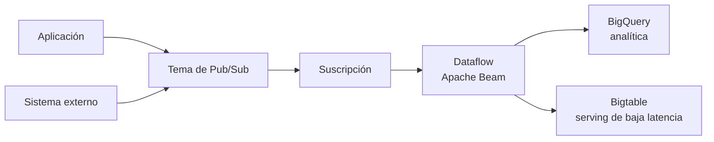

# Streaming con Pub/Sub y Dataflow

> [!abstract] Idea central
> **Pub/Sub** transporta eventos y desacopla productores de consumidores. **Apache Beam** define la canalización y **Dataflow** la ejecuta como servicio administrado, tanto con datos batch como con flujos continuos.

[[Professional Data Engineer/2- Introducción a la ingeniería de datos en Google Cloud/05 - Patrón de extracción, transformación y carga (ETL)/00 - Índice|← Índice de la sección]] · [[01 - ETL con Data Fusion y Dataproc|← ETL y Spark]] · [[03 - Quiz de la sección ETL|Quiz de la sección →]]

## Batch frente a streaming

| | Batch | Streaming |
|---|---|---|
| Datos | colección **acotada** | colección **no acotada** |
| Ejecución | termina al procesar la entrada | continúa mientras llegan eventos |
| Casos típicos | nóminas, facturación, *backfills* | fraude, intrusiones, telemetría |
| Ejemplo | Cloud Storage → Dataflow → BigQuery | Pub/Sub → Dataflow → BigQuery o Bigtable |

> [!warning] No lo confundas con ETL/ELT
> Batch/streaming describe la naturaleza de la entrada. ETL/ELT describe cuándo se transforma respecto de la carga. Un pipeline Dataflow puede ejecutar ETL tanto batch como streaming.

## Patrón de streaming del curso



### Quién hace qué

| Pieza | Responsabilidad |
|---|---|
| **Productor** | publica el evento en un tema |
| **Tema de Pub/Sub** | recibe y distribuye mensajes |
| **Suscripción** | representa el flujo de entrega a un consumidor |
| **Apache Beam** | expresa las fuentes, transformaciones y destinos del pipeline |
| **Dataflow Runner** | ejecuta el pipeline, escala workers y administra el trabajo |
| **BigQuery / Bigtable** | conserva el resultado para analítica o acceso operacional |

Cada suscripción recibe su propia copia de los mensajes de un tema. Si varios consumidores leen **la misma suscripción**, se reparten los mensajes de esa suscripción. Pub/Sub entrega al menos una vez de forma predeterminada; Dataflow streaming usa procesamiento exactamente una vez por defecto y deduplica redeliveries con el mismo `message_id`. Aun así, los efectos externos y los eventos duplicados con identificadores distintos deben diseñarse con idempotencia.

> [!example] Sistema de altas
> Recursos Humanos publica eventos como `employee_created` y `contractor_created`. Suscripciones distintas permiten que seguridad física emita credenciales y que TI aprovisione cuentas sin que los productores conozcan esos sistemas.

## Dataflow y Apache Beam

Dataflow es el servicio de ejecución completamente administrado; Apache Beam es el modelo y los SDK con los que se construye el pipeline. Los SDK de Java, Python y Go permiten usar las mismas abstracciones para batch y streaming.

El ejemplo del curso sigue esta secuencia:

```text
ReadFromPubSub → decodificar y parsear → beam.Map(transformación) → WriteToBigQuery
```

![[Pasted image 20260903120947.png|900]]

*La captura muestra el pipeline en Python: lectura, conversión del JSON a registros y escritura en BigQuery.*

- `ReadFromPubSub` recibe los mensajes como `bytes` de forma predeterminada;
- `beam.Map` aplica una función a cada elemento;
- `WriteToBigQuery` escribe los registros procesados;
- en el ejemplo se usan `CREATE_IF_NEEDED` y `WRITE_APPEND` para crear la tabla si falta y añadir filas.

Para un pipeline estable se usa una **suscripción dedicada** en lugar de leer directamente del tema, lo que evita compartir mensajes de forma impredecible con otros consumidores y conserva el estado a través de reinicios.

En producción también se valida el esquema y se enrutan registros inválidos mediante una salida lateral hacia una tabla o tema de cuarentena. Los notebooks sirven para desarrollar y probar Beam interactivamente; el modelo de ejecución sigue siendo el pipeline.

## Tiempo y ventanas

Una colección no acotada no tiene un “final” que permita agregar todos sus elementos. Beam divide el flujo y decide cuándo emitir resultados:

| Concepto | Pregunta que responde |
|---|---|
| **Event time** | ¿cuándo ocurrió realmente el evento? |
| **Processing time** | ¿cuándo lo procesó el sistema? |
| **Window** | ¿qué grupo temporal se agrega, por ejemplo cada 5 minutos? |
| **Watermark** | ¿cuál es el límite inferior estimado de los timestamps que podrían llegar después? |
| **Trigger** | ¿cuándo se emite un resultado provisional o final? |
| **Late data** | ¿qué hacer con eventos cuya ventana ya fue superada por el watermark? |

El watermark aproxima la completitud en **event time**: cuando supera el final de una ventana, cualquier elemento posterior para esa ventana se considera tardío.

> [!example] Detección de fraude
> Para contar intentos por tarjeta cada cinco minutos, se agrupan por `card_id` y por ventanas de cinco minutos. El watermark permite avanzar aunque algún evento llegue tarde; el trigger puede emitir una alerta temprana y actualizarla después.

## Plantillas de Dataflow

Una plantilla empaqueta una canalización para que pueda desplegarse con parámetros sin tener el entorno de desarrollo original. Esto separa **diseñar** de **ejecutar**.

- Google ofrece plantillas prediseñadas para escenarios comunes.
- También puedes crear plantillas personalizadas.
- Existen **Classic Templates** y **Flex Templates**; para plantillas nuevas, Google recomienda Flex.
- Se ejecutan desde consola, `gcloud` o API y pueden ser lanzadas por un orquestador.

> [!note] Plantilla ≠ programación
> La plantilla describe cómo iniciar el trabajo. Cloud Scheduler, Workflows o Managed Service for Apache Airflow determinan cuándo y en qué secuencia se ejecuta.

## Elegir destino y evitar piezas innecesarias

| Necesidad | Destino o patrón |
|---|---|
| SQL, BI y agregaciones analíticas | **BigQuery** |
| lecturas por clave con muy baja latencia y alto throughput | **Bigtable** |
| Pub/Sub → BigQuery sin transformación compleja y tolerando entrega al menos una vez | **Suscripción de BigQuery** directa |
| ventanas, agregaciones, enriquecimiento o lógica compleja | **Pub/Sub → Dataflow → destino** |

Una suscripción de BigQuery puede evitar Dataflow si solo necesitas entregar mensajes y aplicar cambios ligeros mediante SMT. Añade Dataflow cuando hagan falta ventanas, agregaciones, lógica compleja o deduplicación exactamente una vez.

### Por qué Bigtable aparece en pipelines de streaming

Bigtable usa un modelo **wide-column** organizado por familias de columnas. La clave de fila determina el acceso eficiente, por lo que debe diseñarse a partir de los patrones de consulta y evitando concentrar escrituras en un rango pequeño.

Su baja latencia y alto throughput lo hacen apropiado para servir series temporales, telemetría IoT, datos financieros o *features* de ML a gran escala. No sustituye a BigQuery para consultas SQL analíticas.

## Comparación de motores

| Servicio | Elígelo cuando… |
|---|---|
| **Dataform** | las transformaciones son SQL y ocurren dentro de BigQuery |
| **Dataflow** | necesitas una canalización programable unificada para batch o streaming |
| **Managed Service for Apache Spark / Dataproc** | ya usas Spark/Hadoop o necesitas su ecosistema y APIs |
| **Cloud Data Fusion** | prefieres integración visual con conectores y poco código |

## Puntos de examen

> [!tip] Qué recordar
> - **Pub/Sub transporta; Dataflow procesa.**
> - **Beam define; Dataflow ejecuta.**
> - Batch usa datos acotados; streaming, datos no acotados.
> - Las agregaciones streaming requieren razonar sobre ventanas, watermark, triggers y datos tardíos.
> - Las plantillas reutilizan y parametrizan; no sustituyen la programación u orquestación.
> - Dataflow deduplica redeliveries de Pub/Sub con el mismo `message_id`, pero los efectos externos y duplicados lógicos aún requieren idempotencia.

## Repaso activo

> [!question]- ¿Por qué Pub/Sub desacopla sistemas?
> Porque el productor publica en un tema sin conocer a los consumidores; cada consumidor recibe los mensajes mediante su suscripción.

> [!question]- ¿Qué diferencia existe entre Apache Beam y Dataflow?
> Beam proporciona el modelo y los SDK para definir el pipeline; Dataflow Runner lo ejecuta y administra los recursos.

> [!question]- ¿Por qué una agregación streaming necesita ventanas?
> Porque la entrada no termina; la ventana delimita qué eventos se agrupan en cada resultado.

> [!question]- ¿Cuándo omitirías Dataflow entre Pub/Sub y BigQuery?
> Cuando no hay transformaciones complejas y una suscripción de BigQuery directa cubre la entrega.

> [!question]- ¿Cuándo usarías Bigtable como destino en vez de BigQuery?
> Cuando la aplicación necesita lecturas por clave con latencia muy baja y alto throughput; para agregaciones SQL y BI usaría BigQuery.

> [!question]- ¿Qué ventaja ofrece una Flex Template?
> Empaqueta código y dependencias, acepta parámetros y permite desplegar el trabajo sin reconstruirlo en el entorno del operador.

## Recursos verificados

- [Descripción general de Dataflow](https://cloud.google.com/dataflow/docs/overview)
- [Leer Pub/Sub desde Dataflow](https://cloud.google.com/dataflow/docs/concepts/streaming-with-cloud-pubsub)
- [Conceptos de Pub/Sub](https://cloud.google.com/pubsub/docs/pubsub-basics)
- [Guía de programación de Apache Beam](https://beam.apache.org/documentation/programming-guide/)
- [Plantillas de Dataflow](https://cloud.google.com/dataflow/docs/concepts/dataflow-templates)
- [Suscripciones de BigQuery](https://cloud.google.com/pubsub/docs/bigquery)
- [Descripción general de Bigtable](https://cloud.google.com/bigtable/docs/overview)
