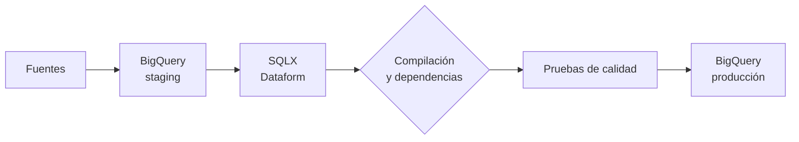
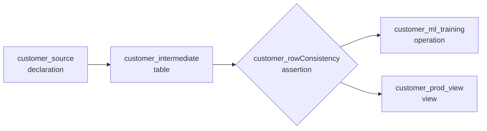

# ELT y Dataform

> [!abstract] Idea central
> En **ELT**, los datos se cargan primero en tablas de *staging* de BigQuery y se transforman después, aprovechando la capacidad de procesamiento de BigQuery. El resultado se materializa en tablas de producción listas para análisis.

[[00 - Índice del módulo|← Índice del módulo]] · [[05 - Carga de datos y BigLake|← Carga y BigLake]] · [[07 - Guía rápida de decisiones|Repaso del módulo →]]

## Mapa del patrón

![[Pasted image 20260902174944.png|900]]

*Datos estructurados → tablas de staging en BigQuery → SQL o Dataform → tablas de producción.*

| Etapa | Qué ocurre | Ejemplo |
|---|---|---|
| **Extract** | Se obtienen datos de los sistemas de origen. | Archivos de Cloud Storage o una base operacional. |
| **Load** | Los datos se cargan sin aplicar toda la lógica de negocio. | `raw.orders` o `staging.customers` en BigQuery. |
| **Transform** | Se limpian, unen, validan y modelan dentro de BigQuery. | SQL, consultas programadas o Dataform. |

> [!tip] ELT frente a ETL
> **ELT** carga antes de transformar y aprovecha BigQuery como motor de cómputo. **ETL** transforma antes de cargar; puede convenir cuando los datos deben filtrarse, enmascararse o adaptarse antes de entrar al destino.

## Cómo se transforma en BigQuery

| Necesidad | Opción adecuada |
|---|---|
| Consulta o transformación puntual | GoogleSQL |
| Varias instrucciones, variables, control de flujo o transacciones | SQL de procedimientos |
| Cálculo reutilizable que devuelve un valor | UDF de SQL; JavaScript solo cuando SQL no alcance |
| Operación parametrizada y reutilizable | Procedimiento almacenado |
| Procesamiento con PySpark | Procedimiento almacenado de Apache Spark |
| Invocar lógica externa | Función remota en Cloud Run functions |
| Explorar con Python datos mayores que la memoria local | Notebook con BigQuery DataFrames |
| Transformación sencilla y periódica | Consulta programada |
| DAG complejo, dependencias, pruebas y documentación | Dataform |

### SQL de procedimientos

BigQuery puede ejecutar varias instrucciones en secuencia y conservar estado compartido. Esto permite:

- declarar variables y consultar variables del sistema;
- crear tablas y ejecutar lógica con `IF` y `WHILE`;
- agrupar operaciones en transacciones para mantener la integridad de los datos.

```sql
DECLARE fecha_proceso DATE DEFAULT CURRENT_DATE();

BEGIN TRANSACTION;
  DELETE FROM `prod.ventas`
  WHERE fecha = fecha_proceso;

  INSERT INTO `prod.ventas`
  SELECT *
  FROM `staging.ventas`
  WHERE fecha = fecha_proceso;
COMMIT TRANSACTION;
```

> [!example] Por qué importa
> Si el proceso se reejecuta para la misma fecha, primero reemplaza ese bloque de datos. Así se evita duplicar filas y la carga se vuelve **idempotente**.

### UDF y procedimientos almacenados

Las **funciones definidas por el usuario (UDF)** sirven para transformaciones personalizadas:

- pueden ser temporales o persistentes;
- pueden escribirse en SQL o JavaScript;
- se recomienda SQL cuando sea posible;
- JavaScript aporta flexibilidad para lógica o bibliotecas externas y permite reutilizar UDF de la comunidad.

Los **procedimientos almacenados** encapsulan varias instrucciones. Aportan reutilización, parámetros y administración de transacciones, y pueden invocarse desde aplicaciones u otros scripts SQL con `CALL`.

BigQuery también admite procedimientos almacenados de **Apache Spark**. Pueden definirse desde el editor de PySpark o con `CREATE PROCEDURE`, usando Python, Java o Scala; el código puede quedar en Cloud Storage o escribirse en línea.

### Funciones remotas

Una función remota permite llamar desde SQL a lógica desplegada en **Cloud Run functions**:

1. se implementa la función, por ejemplo en Python;
2. se crea una conexión de BigQuery y se registra su endpoint;
3. se invoca desde una consulta como si fuera una UDF.

El ejemplo del curso registra `object_length()` para recibir URLs firmadas de objetos de Cloud Storage y devolver información calculada por la función externa.

> [!warning] Úsala con intención
> Una función remota añade una llamada de red y otro servicio que operar. Para lógica expresable en SQL, una UDF de SQL es más sencilla.

### Notebooks y BigQuery DataFrames

Los notebooks de Jupyter integrados con **BigQuery DataFrames** permiten:

- manipular con SQL o Python conjuntos mayores que la memoria del notebook;
- explorar y transformar datos;
- usar bibliotecas de visualización;
- programar ejecuciones.

### Consultas guardadas y programadas

BigQuery permite guardar, versionar y compartir consultas. Una consulta programada automatiza su ejecución definiendo frecuencia, horario y destino de los resultados.

Es suficiente para una transformación periódica simple. Si el flujo necesita dependencias, scripts posteriores, pruebas de calidad o controles adicionales, **Dataform** ofrece una unidad de trabajo más completa.

## Dataform

> [!abstract] Qué resuelve
> Dataform permite desarrollar, probar, documentar, versionar y programar transformaciones ELT en BigQuery. Convierte datos crudos en un conjunto de tablas definido, probado y documentado.



### Flujo de trabajo

1. El código se mantiene en un **repositorio** y se desarrolla en un **workspace**.
2. Dataform compila SQLX y JavaScript a GoogleSQL.
3. Durante la compilación resuelve dependencias y detecta errores, incluidas dependencias faltantes o circulares.
4. BigQuery ejecuta las acciones respetando el grafo de dependencias.
5. Las transformaciones pueden ejecutarse bajo demanda o mediante una programación.

### Estructura básica del proyecto

| Elemento | Función |
|---|---|
| `definitions/*.sqlx` | Tablas, vistas, incrementales, aserciones y operaciones. |
| `includes/*.js` | Funciones y variables JavaScript reutilizables. |
| `workflow_settings.yaml` | Configuración de compilación del proyecto. |
| `.gitignore` | Archivos que Git no debe versionar. |
| `package.json` / `package-lock.json` | Dependencias JavaScript, cuando se necesitan. |
| `README.md` | Documentación opcional del proyecto. |

### Anatomía de un archivo SQLX

Un archivo `.sqlx` puede contener:

- `config`: tipo de acción, metadatos y pruebas de calidad;
- `js`: funciones o variables JavaScript locales;
- `pre_operations`: SQL que corre antes del cuerpo principal;
- cuerpo SQL: la transformación principal;
- `post_operations`: SQL posterior, por ejemplo permisos.

```sql
config {
  type: "table",
  assertions: {
    uniqueKey: ["customer_id"],
    nonNull: ["country"]
  }
}

SELECT
  customer_id,
  country,
  ${mapping.region("country")} AS region
FROM ${ref("customer_source")}
```

> [!note] Qué aporta este ejemplo
> `ref("customer_source")` referencia la tabla y crea una dependencia. `mapping.region(...)` reemplaza un `CASE` repetitivo por una función reutilizable. Las aserciones comprueban unicidad y valores nulos después de crear la tabla.

### Tipos de acciones

| Acción | Uso |
|---|---|
| `declaration` | Declara una fuente de BigQuery administrada fuera de Dataform. |
| `table` | Crea o reemplaza una tabla a partir de un `SELECT`. |
| `incremental` | Procesa solo datos nuevos o modificados. |
| `view` | Crea o reemplaza una vista; puede materializarse cuando corresponde. |
| `assertion` | Ejecuta una prueba de calidad. |
| `operation` | Ejecuta SQL personalizado antes, durante o después del flujo. |

Las dependencias se administran de tres formas:

- `${ref("tabla")}`: referencia y crea una dependencia implícita;
- `dependencies: [...]`: declara dependencias explícitas en `config`;
- `${resolve("tabla")}`: resuelve el nombre sin crear una dependencia.

### Ejemplo de DAG del curso



El grafo hace visible el orden de ejecución y evita coordinar tablas manualmente. Los flujos pueden activarse:

- **internamente**: ejecución manual o programación en Dataform;
- **externamente**: Cloud Scheduler o Cloud Composer.

## Ejemplo completo

Una tienda recibe ventas diarias en Cloud Storage:

1. carga los archivos a `staging.sales` en BigQuery;
2. Dataform limpia tipos, elimina duplicados y une clientes;
3. una aserción comprueba que `order_id` sea único y no nulo;
4. una tabla incremental agrega solo el nuevo día;
5. `prod.daily_sales` queda lista para BI.

La ventaja de ELT aquí es que los datos crudos permanecen disponibles para reprocesar y BigQuery ejecuta la transformación a escala.

## Puntos de examen

> [!tip] Qué recordar
> - **Consulta programada**: transformación sencilla y recurrente.
> - **Dataform**: SQL complejo con dependencias, calidad, documentación y versionado.
> - **UDF**: devuelve un valor; **procedimiento almacenado**: ejecuta una secuencia de operaciones.
> - **`ref()`** crea dependencia; **`resolve()`** solo resuelve el nombre.
> - Prefiere UDF de **SQL** a JavaScript cuando ambas resuelvan el problema.
> - Diseña cargas reejecutables e idempotentes.

## Repaso activo

> [!question]- ¿En qué orden trabaja una canalización ELT?
> Extrae los datos, los carga en el destino y los transforma dentro de ese destino.

> [!question]- ¿Cuándo basta una consulta programada y cuándo conviene Dataform?
> Una consulta programada basta para una transformación periódica simple. Dataform conviene cuando hay varias tablas, dependencias, pruebas, documentación o control de versiones.

> [!question]- ¿Cuál es la diferencia entre una UDF y un procedimiento almacenado?
> La UDF calcula y devuelve un valor dentro de una consulta; el procedimiento ejecuta una secuencia parametrizable de instrucciones y puede administrar transacciones.

> [!question]- ¿Qué diferencia hay entre `ref()` y `resolve()` en Dataform?
> Ambas resuelven el nombre de una relación, pero `ref()` también la incorpora al grafo de dependencias.

> [!question]- ¿Qué acciones de Dataform sirven para calidad y SQL personalizado?
> `assertion` para pruebas de calidad y `operation` para ejecutar instrucciones SQL personalizadas.

> [!question]- ¿Por qué cargar primero datos crudos puede facilitar una recuperación?
> Porque conserva la entrada original y permite corregir la transformación y reprocesar sin volver a extraer desde la fuente.

## Recursos verificados

- [Descripción general de Dataform](https://cloud.google.com/dataform/docs/overview)
- [SQL de procedimientos en BigQuery](https://cloud.google.com/bigquery/docs/procedural-language)
- [Funciones definidas por el usuario](https://cloud.google.com/bigquery/docs/user-defined-functions)
- [Funciones remotas](https://cloud.google.com/bigquery/docs/remote-functions)
- [Programar consultas](https://cloud.google.com/bigquery/docs/scheduling-queries)
