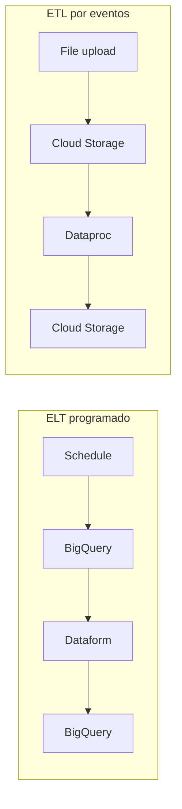

# 06 — Técnicas de automatización

> [!info] Sección del curso
> **Automation Techniques**

[[00 - Índice del curso|← Índice del curso]] · [[Professional Data Engineer/2- Introducción a la ingeniería de datos en Google Cloud/05 - Patrón de extracción, transformación y carga (ETL)/03 - Quiz de la sección ETL|← Quiz ETL]] · [[01 - Patrones y opciones de pipelines|Comenzar la sección →]]

> [!abstract] Objetivo de la sección
> Entender cómo **automatizar y orquestar** cargas ELT/ETL en Google Cloud. Distinguir entre disparo **programado** vs **por eventos**, y elegir el servicio según tipo de trigger, si es serverless y el esfuerzo de código.

## Contenido

| # | Nota | Pregunta que responde |
|---:|---|---|
| 01 | [[01 - Patrones y opciones de pipelines]] | ¿Qué patrones de automatización existen y qué servicios ofrece GCP? |
| 02 | [[02 - Cloud Scheduler y Workflows]] | ¿Cómo programar tareas recurrentes? |
| 03 | [[03 - Cloud Composer]] | ¿Cómo orquestar workflows complejos? |
| 04 | [[04 - Cloud Run Functions]] | ¿Cómo ejecutar código ante eventos? |
| 05 | [[05 - Eventarc]] | ¿Cómo crear una arquitectura unificada por eventos? |

## Tabla comparativa

> [!info] Regla de oro
> Todos los servicios son **serverless, EXCEPTO Cloud Composer**.

| Característica | Cloud Scheduler | Cloud Composer | Cloud Run Functions | Eventarc |
|---|---|---|---|---|
| **Tipo de trigger** | schedule, manual | schedule, manual | event | event |
| **Serverless** | ✅ sí | ❌ **no** | ✅ sí | ✅ sí |
| **Esfuerzo de código** | bajo | medio | alto | alto |
| **Idiomas** | YAML (con Workflows) | Python | Python, Java, Go, Node.js, Ruby, PHP, .NET core | cualquiera (language-agnostic) |

## Patrones de automatización

## Progreso de estudio

- [ ] 1. Patrones y opciones de pipelines
- [ ] 2. Cloud Scheduler y Workflows
- [ ] 3. Cloud Composer
- [ ] 4. Cloud Run Functions
- [ ] 5. Eventarc

## Método recomendado

1. Lee el **resumen** y explica los diagramas/patrones sin memorizar.
2. Estudia los **puntos de examen**.
3. Cierra las respuestas del **repaso activo** e intenta responderlas.
4. Justifica **por qué descartas** un servicio a favor de otro (la tabla comparativa ayuda).
