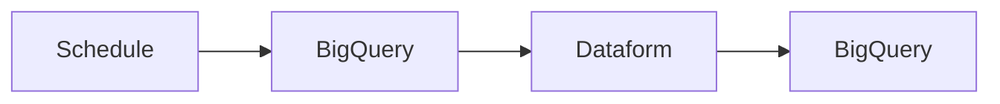
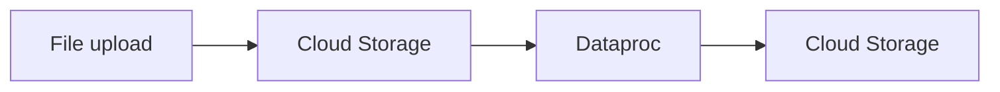

# 01 — Patrones y opciones de pipelines

[[00 - Índice|Índice de la sección]] · [[02 - Cloud Scheduler y Workflows|Siguiente: Cloud Scheduler y Workflows →]]

> [!abstract] Resumen
> En Google Cloud, las cargas **ELT y ETL** se pueden automatizar para ejecutarse de forma **recurrente**.
> - **ELT programado (scheduled):** un schedule dispara la extracción desde BigQuery, transforma con Dataform y vuelve a cargar en BigQuery.
> - **ETL por eventos (event-driven):** la subida de un archivo a Cloud Storage dispara un proceso batch con Dataproc, y los datos aterrizan de vuelta en Cloud Storage.
> El servicio a elegir depende de si el disparo es **programado/manual** o **por eventos**.

## Patrones principales

### ELT programado

### ETL por eventos (batch)

## Los 4 servicios de automatización

| Servicio | Rol | Cuándo usarlo |
|---|---|---|
| **Cloud Scheduler** | Tareas programadas / one-off | Tareas en intervalos definidos |
| **Cloud Composer** | Orquestación (Airflow) | Workflows complejos con dependencias |
| **Cloud Run Functions** | Código ante eventos | Reaccionar a eventos GCP |
| **Eventarc** | Enrutar eventos | Arquitectura unificada por eventos |

## Elección rápida

| Necesidad | Opción |
|---|---|
| Tareas programadas o one-off | **Cloud Scheduler** o **Cloud Composer** |
| Orquestación de workflows | **Cloud Composer** |
| Acciones basadas en eventos | **Cloud Run Functions** o **Eventarc** |

> [!success] Puntos de examen
> 1. **ELT programado** vs **ETL por eventos** es la bifurcación conceptual.
> 2. Dataform (ELT) y Dataproc (ETL) son los motores de los ejemplos.
> 3. Scheduler/Composer = **programado**; Cloud Run Functions/Eventarc = **por eventos**.

> [!warning] Trampa de examen
> No confundas "programado" con "por eventos": lo que define al evento es que **la acción la dispara un cambio de estado** (subida de archivo, insert en BD), no un horario.

## Preguntas de repaso

> [!question]- 1. ¿Cuál es la diferencia entre ELT programado y ETL por eventos?
> ELT programado se dispara por un schedule (BigQuery→Dataform→BigQuery). ETL por eventos se dispara cuando ocurre algo (subida de archivo→Dataproc). Uno es temporal, el otro reactivo.

> [!question]- 2. ¿Qué servicio usarías para orquestar un workflow complejo?
> **Cloud Composer**, porque está diseñado para orquestación con dependencias.
