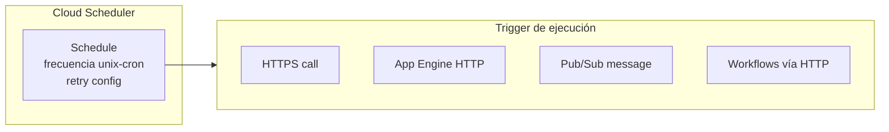
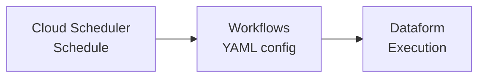

# 02 — Cloud Scheduler y Workflows

[[Professional Data Engineer/2- Introducción a la ingeniería de datos en Google Cloud/06 - Técnicas de automatización/00 - Índice|Índice de la sección]] · [[01 - Patrones y opciones de pipelines|← Anterior: Patrones y opciones]] · [[03 - Cloud Composer|Siguiente: Cloud Composer →]]

> [!abstract] Resumen
> **Cloud Scheduler** automatiza tareas invocando tus workloads en **intervalos recurrentes** definidos. Te permite fijar tanto la **frecuencia** como la **hora exacta** del día. Los disparos pueden basarse en llamadas **HTTPS**, **App Engine HTTP**, mensajes **Pub/Sub**, o **Workflows**. Es de **bajo esfuerzo** porque se configura en gran parte con **YAML**.

## Cómo funciona



- **Frecuencia:** formato **unix-cron**.
- **Configuración de reintentos (retry):** se maneja desde el job.

## Ejemplo: disparar un workflow SQL de Dataform

El job programado inicia un proceso definido en un **archivo YAML** con dos pasos:

```yaml
- createCompilationResult:
    call: http.post
    args:
      url: ${"https://dataform.googleapis.com/[...]"}
      auth:
        type: OAuth2
      body:
        gitCommitish: <your_branch>
    result: compilationResult
- createWorkflowInvocation:
    call: http.post
    args:
      url: ${"https://dataform.googleapis.com/[...]"}
      auth:
        type: OAuth2
      body:
        compilationResult: ${compilationResult.body.name}
        invocationConfig:
          includedTags:
            - <your_tag>
    result: workflowInvocation
```

Flujo:



> [!important] Qué hace el ejemplo
> 1. Crea un **compilation result** desde el código de Dataform.
> 2. Dispara la **invocación del workflow** usando ese resultado, ejecutando **solo ciertas partes** del proyecto de Dataform según los **tags incluidos** (`includedTags`).

> [!success] Puntos de examen
> 1. Cloud Scheduler define **frecuencia (unix-cron)** y **reintentos**.
> 2. Los triggers pueden ser **HTTPS, App Engine HTTP, Pub/Sub o Workflows**.
> 3. Se integra con **Dataform** como ejemplo de automatización programada.
> 4. **Esfuerzo bajo** → configuración por **YAML**.

> [!warning] Trampa de examen
> "Clouduler" en las transcripciones automáticas es un error de reconocimiento de voz. El servicio se llama **Cloud Scheduler**.

## Preguntas de repaso

> [!question]- 1. ¿Qué disparos soporta Cloud Scheduler?
> HTTPS call, App Engine HTTP, Pub/Sub message y Workflows vía HTTP.

> [!question]- 2. ¿Cómo se define la frecuencia de un job?
> Con formato **unix-cron** en la configuración del schedule.
