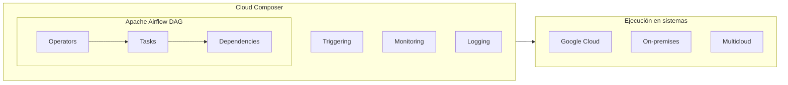
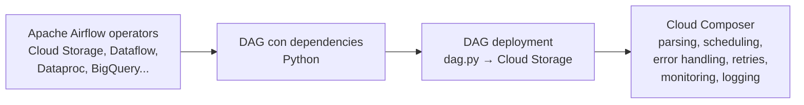
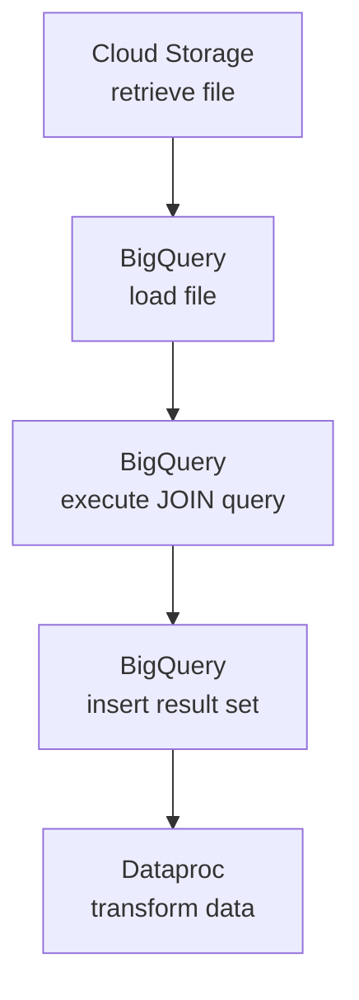

# 03 — Cloud Composer

[[Professional Data Engineer/2- Introducción a la ingeniería de datos en Google Cloud/06 - Técnicas de automatización/00 - Índice|Índice de la sección]] · [[02 - Cloud Scheduler y Workflows|← Anterior: Cloud Scheduler y Workflows]] · [[04 - Cloud Run Functions|Siguiente: Cloud Run Functions →]]

> [!abstract] Resumen
> **Cloud Composer** es un **orquestador central** basado en **Apache Airflow**. Integra pipelines a través de sistemas diversos — **Google Cloud, on-premises o multicloud**. Usa **operators, tasks y dependencies** para definir y gestionar workflows. Ofrece funcionalidades de **triggering, monitoring y logging** para control completo de la ejecución.
> ⚠️ **NO es serverless** (a diferencia del resto) → se admin entornos de Airflow. **Esfuerzo medio** → se desarrolla en **Python**.

## Arquitectura



## Desarrollar un DAG en Python



- **Operators** de Airflow (Cloud Storage, Dataflow, Dataproc, BigQuery, etc.).
- Se define el **DAG** (grafo acíclico dirigido) con **tasks y dependencias**.
- Se **despliega** (`dag.py`) a Cloud Storage; Composer hace el **parsing y scheduling**.
- Composer gestiona la ejecución: **error handling, retries, monitoring**.

## Ejemplo: DAG de analítica de datos

```python
with models.DAG(
    "data_analytics_dag",
    # Define schedule and default args
) as dag:
    create_batch = DataprocCreateBatchOperator(
        # Specify Dataproc settings, e.g. which
        # Python file to execute
    )

    load_external_dataset = GCSToBigQueryOperator(
        # Specify Cloud Storage source file to load
        # and BigQuery table destination
    )

    with TaskGroup("join_bq_datasets") as bq_join_group:
        # Define the SQL query in BigQuery to join
        # the loaded table with another one
        bq_join_holidays_weather_data = BigQueryInsertJobOperator(
            # Execute query and insert result into BigQuery table
        )

    # define the dependencies of the workflow
    load_external_dataset >> bq_join_group >> create_batch
```

Flujo:



> [!success] Puntos de examen
> 1. Cloud Composer se basa en **Apache Airflow**.
> 2. Elementos: **operators, tasks, dependencies**.
> 3. Se define en **Python** (DAG) y se despliega como `dag.py` a Cloud Storage.
> 4. Ofrece **triggering, monitoring, logging**; gestiona **error handling y retries**.
> 5. Orquesta en **Google Cloud, on-premises y multicloud**.
> 6. **NO es serverless** → es el único de la lista que administra infraestructura.

> [!warning] Trampa de examen
> Composer es el **único servicio de automatización que NO es serverless**. Si el escenario exige la menor administración posible, otro servicio puede ser mejor; si exige orquestación compleja, Composer.

## Preguntas de repaso

> [!question]- 1. ¿En qué se basa Cloud Composer y con qué se define un workflow?
> Se basa en **Apache Airflow**. Un workflow se define como un **DAG en Python** usando **operators**, con **tasks y dependencias**.

> [!question]- 2. ¿Qué diferencia a Cloud Composer del resto?
> **No es serverless** y es el apto para **orquestación compleja** (GCP, on-prem, multicloud).
