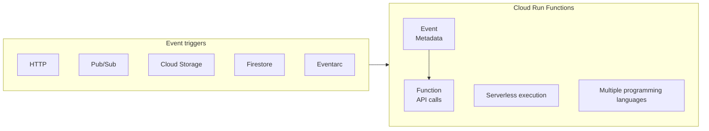
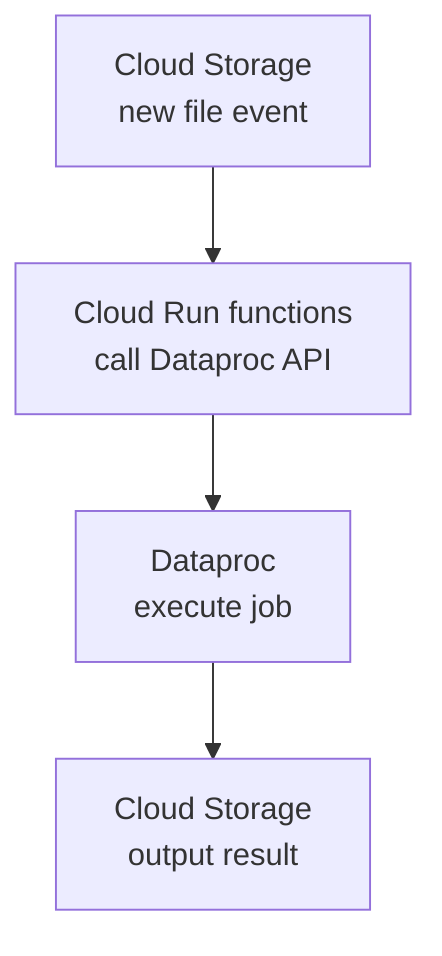

# 04 — Cloud Run Functions

[[Professional Data Engineer/2- Introducción a la ingeniería de datos en Google Cloud/06 - Técnicas de automatización/00 - Índice|Índice de la sección]] · [[03 - Cloud Composer|← Anterior: Cloud Composer]] · [[05 - Eventarc|Siguiente: Eventarc →]]

> [!abstract] Resumen
> **Cloud Run Functions** ejecuta código en respuesta a **eventos de Google Cloud**. Los eventos pueden venir de **HTTP requests, Pub/Sub messages, cambios en Cloud Storage, actualizaciones de Firestore, o eventos personalizados vía Eventarc**. Provee un entorno de ejecución **serverless** y soporta **múltiples lenguajes**. Es **event-driven** y de **esfuerzo alto** (código real).

## Cómo funciona



- **Event triggers:** HTTP, Pub/Sub, Cloud Storage, Firestore, Eventarc.
- **Serverless execution** + **múltiples lenguajes** (Python, Java, Go, Node.js, Ruby, PHP, .NET core).

## Ejemplo: disparar un template de Dataproc tras subir un archivo

```javascript
// pre-work: define project ID, workflow template, region
// set up Dataproc API client in specific region
const client = new dataproc.WorkflowTemplateServiceClient({
  apiEndpoint: `${region}-dataproc.googleapis.com`,
});

// retrieve bucket and name of new object on Cloud Storage
const file = data;
const inputBucketUri = `gs://${file.bucket}/${file.name}`;

// construct request to Dataproc API
const request = {
  name: client.projectRegionWorkflowTemplatePath(projectId, region, workflowTemplate),
  parameters: { "INPUT_BUCKET_URI": inputBucketUri }
};

// call API to launch the workflow
client.instantiateWorkflowTemplate(request)
  .then(responses => { console.log("Launched Dataproc Workflow:", responses[1]); })
  .catch(err => { console.error(err); });
```

Flujo:



> [!important] Qué hace el ejemplo
> La función captura el evento de **nuevo archivo en Cloud Storage**, llama a la **API de Dataproc** y ejecuta el **template de workflow** usando el archivo subido como parámetro. El resultado se guarda en Cloud Storage.

> [!success] Puntos de examen
> 1. Cloud Run Functions ejecuta código ante **eventos GCP** (HTTP, Pub/Sub, GCS, Firestore, Eventarc).
> 2. Entorno **serverless**, **múltiples lenguajes**.
> 3. Caso típico: **nuevo archivo en GCS → disparar un job de Dataproc**.
> 4. Es **event-driven** y de **esfuerzo alto** (se escribe código).

> [!warning] Trampa de examen
> Cloud Run Functions es para **código ante eventos**. No es un orquestador (eso es Composer) ni un programador (eso es Scheduler).

## Preguntas de repaso

> [!question]- 1. ¿Qué eventos pueden disparar una Cloud Run Function?
> HTTP requests, Pub/Sub messages, cambios en Cloud Storage, updates de Firestore, o eventos personalizados vía Eventarc.

> [!question]- 2. ¿Cómo se usa para automatizar Dataproc?
> Se usa una función que captura el evento de nuevo archivo, llama a la **API de Dataproc** y ejecuta un **workflow template** con el archivo como input.
