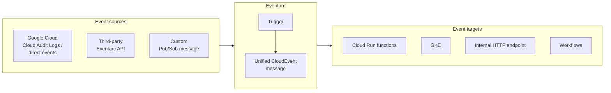
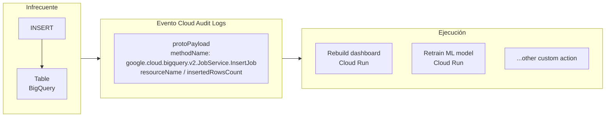

# 05 — Eventarc

[[Professional Data Engineer/2- Introducción a la ingeniería de datos en Google Cloud/06 - Técnicas de automatización/00 - Índice|Índice de la sección]] · [[04 - Cloud Run Functions|← Anterior: Cloud Run Functions]] · [[99 - Guía rápida de decisiones|Repaso del curso →]]

> [!abstract] Resumen
> **Eventarc** permite crear una **arquitectura unificada por eventos** para servicios **débilmente acoplados**. Conecta **fuentes de eventos** (servicios de Google Cloud, sistemas terceros, eventos personalizados vía Pub/Sub) con **destinos** (Cloud Run Functions, GKE, endpoints HTTP internos, Workflows). Usa el **formato estándar CloudEvent**, que simplifica la integración y facilita apps **responsivas y escalables**. Es **language-agnostic** y de **esfuerzo alto**.

## Arquitectura

- **Fuentes:** Google Cloud (Cloud Audit Logs, eventos directos), terceros (Eventarc API), custom (Pub/Sub).
- **Destinos:** Cloud Run Functions, GKE, endpoints HTTP internos, Workflows.
- Formato estándar **CloudEvent**.

## Ejemplo: responder a eventos INSERT en BigQuery

Cuando ocurre un **insert** en una tabla de BigQuery, se genera **un evento de Cloud Audit Logs**. Eventarc lo captura e inicia acciones: **rebuild dashboard, retrain ML model**, o cualquier acción personalizada.

> [!success] Puntos de examen
> 1. Eventarc crea una arquitectura **unificada por eventos** para servicios **débilmente acoplados**.
> 2. Usa **formato estándar CloudEvent**.
> 3. Conecta **fuentes** (GCP, terceros, Pub/Sub) con **destinos** (Cloud Run, GKE, HTTP, Workflows).
> 4. **Language-agnostic**.
> 5. Ejemplo: reaccionar a **inserts en BigQuery** vía **Cloud Audit Logs** (rebuild dashboard / retrain ML).

> [!warning] Trampa de examen
> Eventarc **enruta eventos**; no ejecuta código ni orquesta. Para ejecución usás Cloud Run Functions u otros destinos. Para orquestación, Composer.

## Preguntas de repaso

> [!question]- 1. ¿Qué resuelve Eventarc y con qué formato?
> Crea una arquitectura unificada por eventos para servicios débilmente acoplados, usando el **formato CloudEvent**.

> [!question]- 2. Da un ejemplo de caso de uso.
> Reaccionar a un **INSERT en BigQuery** (vía Cloud Audit Logs) para **rebuild dashboard** o **retrain ML model**.

> [!question]- 3. ¿Cómo se relaciona con Cloud Run Functions?
> Cloud Run Functions puede ser un **destino** de Eventarc (un trigger que ejecuta la función ante un evento).

---

## Fuentes oficiales

- [Cloud Scheduler](https://cloud.google.com/scheduler/docs)
- [Workflows](https://cloud.google.com/workflows/docs)
- [Cloud Composer](https://cloud.google.com/composer/docs)
- [Cloud Run Functions](https://cloud.google.com/functions/docs)
- [Eventarc](https://cloud.google.com/eventarc/docs)
