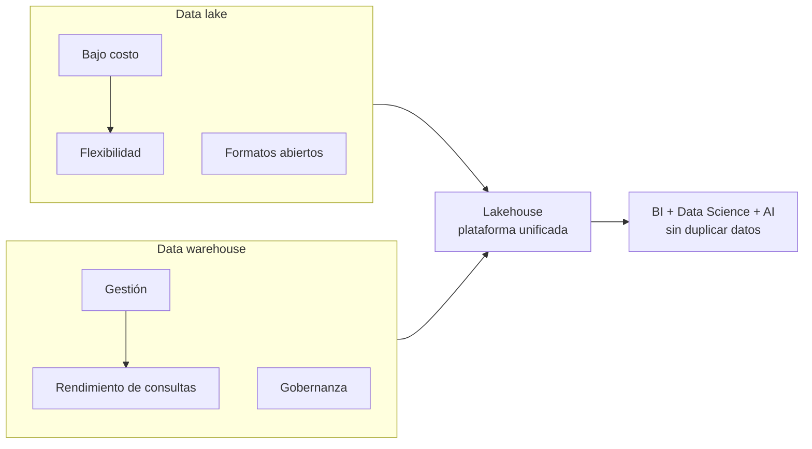

# 02 — El enfoque moderno: Data lakehouse

[[Professional Data Engineer/3- Crea data lakes y almacenes de datos en Google Cloud/01 - Introducción a la Ingeniería de Datos Moderna/00 - Índice|Índice del módulo]] · [[01 - Los clásicos - data lakes y data warehouses|← Anterior: Los clásicos]] · [[03 - Elegir la arquitectura correcta|Siguiente: Elegir la arquitectura →]]

> [!abstract] Resumen
> Por su naturaleza complementaria, el enfoque ideal combina la **flexibilidad y bajo costo de un data lake** con la **velocidad y precisión de un data warehouse**. Esa combinación crea el concepto de **data lakehouse**: una **plataforma unificada** que soporta BI tradicional, data science y AI **sin mover ni duplicar datos**.

## Qué es un lakehouse

Una arquitectura **data lakehouse** combina:

- Almacenamiento de **bajo costo** del data lake.
- **Features de gestión y rendimiento de consultas** del data warehouse.

El objetivo: una **única plataforma unificada** para **BI tradicional, data science moderno y cargas de AI**, **sin mover ni duplicar datos**.

## Cómo se logra

> [!important] Mecanismo
> Un lakehouse implementa una **capa de metadatos y gobernanza** sobre **archivos open-format** almacenados en **object storage de bajo costo** (ej. Google Cloud Storage). **Lo mejor de ambos mundos.**

## ¿Cuáles son las características clave?

| # | Característica |
|---:|---|
| 1 | Soporte para la **mayoría de formatos de datos** |
| 2 | **Schema-on-read** o **schema-on-write** flexible |
| 3 | Acceso para **todo tipo de usuarios de datos** |
| 4 | **Flexibilidad de costo** según necesidades |
| 5 | **Gobernanza unificada** |
| 6 | Soporte de **transacciones ACID** |

## Lakehouse en Google Cloud

Google Cloud implementa lakehouses mediante la tecnología **Lakehouse**:

- Aplica **gobernanza y capacidades de consulta** a datos en **GCP o en otras nubes mayores**.
- Gestiona y consulta los datos **donde viven**, usando formatos abiertos: **Parquet, ORC, Avro**.
- Aprovecha el **motor de consultas de BigQuery** (potente y flexible).

## Beneficios

- Reducción de **redundancia de datos**.
- **Gobernanza unificada**.
- **Silos de datos rotos**.
- Mayor **flexibilidad y escalabilidad**.

## Caso de uso: Cymbal

> [!example] Cómo rompe silos
> Para **Cymbal**, el lakehouse resuelve romper silos: sus **datos de ventas** estaban en un warehouse y sus **reseñas de clientes** en un data lake. Antes no podían analizarse juntos fácilmente. Con un lakehouse, Cymbal puede ejecutar **una sola consulta** para correlacionar el **sentimiento de los textos de reseñas** con las **tendencias de ventas** de su base transaccional.

> [!success] Puntos de examen
> 1. **Lakehouse = data lake + data warehouse** (flexibilidad + gestión/rendimiento).
> 2. Meta: **plataforma unificada** para BI, data science y AI **sin duplicar datos**.
> 3. Se logra con una **capa de metadatos/gobernanza** sobre **archivos open-format** en **object storage**.
> 4. Formatos abiertos: **Parquet, ORC, Avro**.
> 5. Características clave: formatos, schema-on-read/write, acceso a todos los usuarios, costo flexible, **gobernanza unificada**, **ACID**.
> 6. Motivación típica: **romper silos** (ej. datos de ventas + reseñas en un solo query).

> [!warning] Trampa de examen
> Lakehouse **no es un producto único** — es una **arquitectura**. En GCP se implementa con la capa de metadatos/gobernanza sobre archivos abiertos + el motor de BigQuery.

## Preguntas de repaso

> [!question]- 1. ¿Qué combina un data lakehouse?
> La flexibilidad y bajo costo del **data lake** con la gestión y el rendimiento de consultas del **data warehouse**, en una **plataforma unificada**.

> [!question]- 2. ¿Cómo se implementa un lakehouse en Google Cloud?
> Con una **capa de metadatos y gobernanza** sobre **archivos open-format** (Parquet, ORC, Avro) en object storage, consultados por el **motor de BigQuery**.

> [!question]- 3. Menciona 3 características clave.
> Soporte de la mayoría de formatos, schema-on-read/on-write flexible, gobernanza unificada (o ACID, costo flexible, acceso a todos los usuarios).

## Fuentes oficiales

- [Introducción a BigLake](https://cloud.google.com/bigquery/docs/biglake-introduction)
- [Formatos de datos compatibles](https://cloud.google.com/bigquery/docs/biglake-supported-formats)
