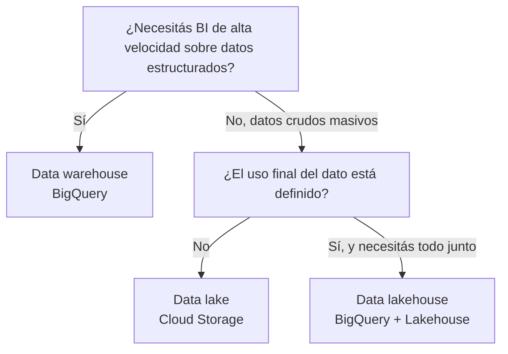

# 03 — Elegir la arquitectura correcta

[[Professional Data Engineer/3- Crea data lakes y almacenes de datos en Google Cloud/01 - Introducción a la Ingeniería de Datos Moderna/00 - Índice|Índice del módulo]] · [[02 - El enfoque moderno - Data lakehouse|← Anterior: Data lakehouse]]

> [!abstract] Resumen
> Aunque el **data lakehouse** es el enfoque más nuevo, un **data lake** o un **data warehouse** pueden encajar mejor según las **necesidades específicas**. La elección depende de **qué priorizás**: BI de alta velocidad sobre datos estructurados, almacenamiento crudo de bajo costo, o BI + AI + data science sobre una copia única gobernada.

## Tabla de decisión

| Arquitectura | Tecnología | Cuándo elegirla | Ejemplo (Cymbal) |
|---|---|---|---|
| **Data warehouse** | BigQuery | **BI interactiva de alta velocidad** sobre **datos estructurados** de negocio | Depto. de finanzas |
| **Data lake** | Cloud Storage | **Almacenamiento inicial de bajo costo** de **grandes volúmenes de datos crudos**, cuyo **uso final aún no está definido** | AI/ML research & development |
| **Data lakehouse** | BigQuery + Lakehouse | Necesitás **todo**: BI + AI + data science sobre una **copia única y gobernada** de tus datos, con **vista holística** para toda la empresa | Toda la compañía |

## Cómo elegir

> [!success] Puntos de examen
> 1. **Data warehouse (BigQuery):** BI interactiva de alta velocidad sobre **datos estructurados de negocio**.
> 2. **Data lake (Cloud Storage):** **almacenamiento inicial de bajo costo** de **datos crudos masivos**; uso final **no definido** (AI/ML R&D).
> 3. **Data lakehouse (BigQuery + Lakehouse):** **BI + AI + data science** sobre una **copia única gobernada**, **vista holística** para toda la empresa.
> 4. Lakehouse no siempre es la respuesta: la elección depende de **qué priorizás** (velocidad BI, costo de almacenamiento crudo, o todo unificado).

> [!warning] Trampa de examen
> No elijas **data lakehouse** por defecto porque sea lo "más nuevo". Si el caso es **solo BI rápida sobre datos estructurados**, el **data warehouse** es más directo. Si es **almacenar datos crudos masivos cuyo uso aún no sabés**, el **data lake** es lo correcto.

## Preguntas de repaso

> [!question]- 1. ¿Cuándo conviene un data warehouse (BigQuery)?
> Cuando la necesidad principal es **BI interactiva de alta velocidad** sobre **datos estructurados** de negocio.

> [!question]- 2. ¿Cuándo conviene un data lake (Cloud Storage)?
> Para **almacenamiento inicial de bajo costo** de **grandes volúmenes de datos crudos** cuyo **uso final aún no está definido** (ej. AI/ML R&D).

> [!question]- 3. ¿Cuándo un data lakehouse?
> Cuando necesitás **BI + AI + data science** sobre una **copia única y gobernada**, con **vista holística** para toda la empresa.

## Fuentes oficiales

- [Descripción general de BigQuery](https://cloud.google.com/bigquery/docs/introduction)
- [Data lakehouse y Lakehouse](https://cloud.google.com/bigquery/docs/biglake-introduction)
